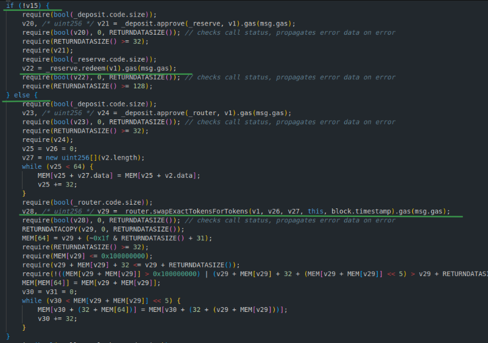

# **ELEPHANT MONEY VULNERABILITY REPORT**
## **SUMMARY**

  This is a report about a vulnerability discovered in a unverified contract (0x6839e295a8f13864A2830fA0dCC0F52e71a82DbF) of the Elephant Money project of the Binance Smart Chain. This flaw has a critical impact on the Trunk token (0xdd325C38b12903B727D16961e61333f4871A70E0), as it depends on the price of Trunk to be exploited, the damage will increase as the price of Trunk increases. For example, on July 21, with Trunk's price at $1.59 per token, direct losses would have been $1,016,968 with Trunk falling from 1.59 to 1.01, a 36 percent. Basically, there is a function ( sweep() ) in the vulnerable contract with no access control that allows a bad actor to trigger a cascade of swaps, which through flash loans and price manipulation of some assets could seriously harm EM users. I provide POCs using foundry to demonstrate what Im talking about. BUT, It's not all bad news, I have also discovered how to solve it !!! Below a detailed explanation of how this exploit is possible and how to avoid it.

## **SWEEP CALLS FLOW** 
  The sweep() function of the vulnerable contract is complex and it has various steps. Therefore, for ease of understanding, I won't explain each function steps, but rather give you a general idea of ​​how it works: 

  - Get Trunk balance of "Vulnerable contract". _deposit is the Trunk token.
    
    

  - Get amount out of Busd if we sell the balance of "Vulnerable contract" in the Trunk/Busd pair.
  
    

  - If boolean variable stor_6_20_20 is true (this variable at the moment is set to True), the output of getAmountsOut() if we sell the Trunk balance of the vulnerable contract in the TRUNK/BUSD pool is compared with the balance of the Trunk balance   of the vulnerable contract multiply by 99/100 , because variable _slippageRate is set to 1. MEM[64 + MEM[64]] memory position is the output of getAmountsOut().

    

  - If v15 is false, the sweep() function will revert because to call redeem() in _reserve contract(0xA70A8dc7BDf000c8f9374C5B4A542B3656EBad79) the msg.sender needs to be whitelisted, so we are safe if v15 is false, so , as long as the       
  getAmountsOut( "Trunk balance of vulnerable contract", [TRUNK/BUSD] ) returns a value less than the balance of Trunk of the "vulnerable contract" we are ok. (remember this because it's important).

  - If v15 is true, Trunk balance of the vulnerable contract will be swapped for BUSD.
  
    

    

  - Swap the obtained BUSDs for WBNB. **THIS IS THE CRITICAL STEP**, here is where a bad actor can use flash loans to manipulate the price of WBNB in the pool WBNB/BUSD, because the swap function doesn't have slippage protection. 

    

    

  - Swap the obtained WBNB for ELEPHANT MONEY token (0xE283D0e3B8c102BAdF5E8166B73E02D96d92F688).

    

  - Add liquidity to ELPHANT MONEY/BUSD pool.

    
     
## **CRITICAL PRICE**
  I created a fuzzing code snippet to find out what is the critical price where the exploit can be possible. As I said before sweep() function will revert when v15 is false , and this will happen when the output of getAmountsOut( "Trunk balance of vulnerable contract", [TRUNK/BUSD] ) is bigger than "Trunk balance of vulnerable contract". The exploit will be possible when the price of TRUNK is above $1.20. I've to point out that the price of Trunk doesn't have to be strictly above 1.20, since even if it is less than 1.20, the attacker can manipulate the price of Trunk ,then proceed with the exploit as I have explained above. The minimum price of Trunk where the exploit is possible is 0.60 cents. 

## **EXPLOIT POCS** 
  I've created two POCs to demonstrate the exploit. [The first POC](POCs/poc.em.block.40673000.sol) is the case when Trunk's price is above 1.20 dollars , 1.59 to be precise , with more than 1 million direct losses, on July 21 , block number 40673000. [The second POC](POCs/poc.em.block.41464000.sol) is the case when Trunk's price is below 1.20 dollars, 0.88 cents, with approximately 300 K direct losses, on August 18, block number 41464000. 

## **MITIGATION** 
  As I said , not everything are bad news, if you have read this report this far, you don't want to miss the best part :). If you pay attention , we saw that sweep(), the vulnerable function, will revert if v15 is false, well , at the moment v15 is initialized as True (stor_6_20_20), but fortunately there is a function ( 0x671cc612(bool varg0) ) that can change this value to False, this function has access control and can only be called by the owner of the contract, in this case, the ownership has not been renounced and the owner is the Elephant Money deployer [(0x16E76819aC1f0dfBECc48dFE93B198830e0C85EB)](https://bscscan.com/address/0x16e76819ac1f0dfbecc48dfe93b198830e0c85eb), BINGO !!! 

  
  

   
